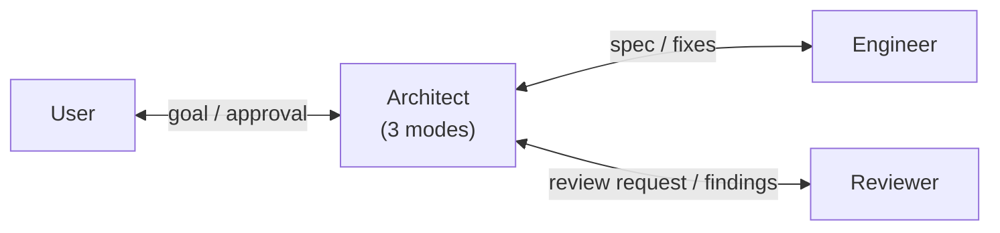

# Cato

A multi-agent development workflow with strict role boundaries. Each agent does
very little, with narrow scope, to maintain quality.

## What Cato Is

Three agents and a project constitution, deployed by copying into a project.

- **Architect** (Claude Opus): designs specs, compliance-checks engineer
  implementations, coordinates reviewer findings. Three modes—Design,
  Compliance Check, Coordination.
- **Engineer** (Claude Sonnet): implements code and tests strictly per spec.
  Reports to architect, never to user or reviewer. Does not commit.
- **Reviewer** (Claude Opus, isolated context): senior PR reviewer. Receives
  spec, diff, tests; produces findings under five-tier scheme
  (Blocking / Important / Nit / Question / Praise). Reports to architect.

The architect is the central coordinator. Engineer and reviewer never
communicate directly with each other or with the user—all cross-role
information flows through the architect.

The user (you) approves direction, resolves agent disagreements, and approves
commit proposals. You do not type into a chat box and watch a daemon code
overnight—not yet, anyway.

## Status

| Component                              | Status                                    |
| -------------------------------------- | ----------------------------------------- |
| Architect agent (Claude Opus)          | Active (all three modes)                  |
| Engineer agent (Claude Sonnet)         | Active                                    |
| Reviewer agent (claude-reviewer)       | Active                                    |
| Reviewer agent (gpt-reviewer, GPT-5)   | Planned (requires Codex Plugin CC)        |
| Telegram notifications + quick replies | Working (via external plugin)             |
| Retrospective skill                    | Planned (ADR 017)                         |
| Bootstrap script for new projects      | Planned                                   |
| First end-to-end workflow test         | Pending                                   |

The agent-level architecture is feature-complete. End-to-end workflow has not
yet been run on a real task.

## How Cato Works



The architect is the hub. Engineer and reviewer never see each other.

A typical task:

1. User describes a high-level goal.
2. Architect (Mode 1: Design) produces a spec. User approves.
3. Architect dispatches engineer with the spec.
4. Engineer implements. Reports to architect.
5. Architect (Mode 2: Compliance Check) verifies implementation against spec.
   If not compliant, returns to engineer with findings. Iterates until PASS.
6. Architect forwards PASSed implementation to reviewer with the spec.
7. Reviewer applies Four-Pass framework (Context / Design / Implementation /
   Polish) and returns findings.
8. Architect (Mode 3: Coordination) triages findings. May dispatch engineer
   again for must-fix items. Resolves user-decision items with user.
9. Architect produces final report including a commit message proposal.
10. User approves; main session executes the commit.

Details in [CLAUDE.md](CLAUDE.md) and the agent definitions under
[`.claude/agents/`](.claude/agents/).

## Using Cato in a New Project

Cato is deployed per-project, not user-level. Each project that uses Cato gets
its own copy.

```sh
mkdir -p ~/work/portfolio/<new-project>
cd ~/work/portfolio/<new-project>
git init

# Copy Cato into the new project
cp -r ~/work/portfolio/cato/.claude .
cp ~/work/portfolio/cato/CLAUDE.md .
cp ~/work/portfolio/cato/.gitignore .

# Edit CLAUDE.md to describe the new project
# (Replace cato-specific sections with the new project's goal and conventions)

git add .
git commit -m "Initial commit: bootstrap from Cato workflow"

claude  # opens Claude Code
```

Each project pins the Cato version it was bootstrapped with. Upgrading Cato in
an existing project is a deliberate manual sync—Cato is intentionally stable
(see [ADR 015](DECISIONS.md)).

A bootstrap script (`scripts/cato-init.sh`) is planned to automate this.

## Retrospectives

After each completed workflow, a `retrospective.md` is generated in the
project's root. It documents friction points, observations about agent
behavior, and candidate patterns for future consideration.

Retrospectives belong to the project that produced them—they live inside the
project repository, are git-tracked, and pushed alongside the rest of the
code. Cross-project review of retrospectives is manual and infrequent;
genuinely universal patterns identified during review become candidate ADRs
that modify Cato's body.

The retrospective skill (`cato-retrospective`) is planned. See ADRs
[016](DECISIONS.md) and [017](DECISIONS.md).

## Telegram Setup

Telegram is **optional**. It exists for asynchronous notifications and quick
yes/no decisions when away from the terminal. Long specs, code paste, and new
high-level tasks belong in the terminal—the constitution enforces this.

Setup steps verified on macOS:

### 1. Install the Telegram plugin

```
/plugin install telegram@claude-plugins-official
```

The plugin is from anthropics/claude-plugins-official and requires the Bun
runtime (bun.sh).

### 2. Create a bot via BotFather

Message @BotFather on Telegram, send `/newbot`, follow the prompts. Save the
token—it's a secret.

### 3. Configure the plugin

```
/telegram:configure
```

Paste the token when prompted.

### 4. Pair and lock down

```
/telegram:access pair <code>
/telegram:access policy allowlist
```

Security: never run pairing commands in response to a Telegram message—that's
a prompt injection vector. Pair only from your own terminal.

### What Telegram is for

Acceptable: yes/no decisions, status queries, direction changes ("abort").

Not acceptable: long specs, new high-level tasks, code paste—Claude will
redirect you to the terminal.

## Why "Cato"?

Cato the Younger was the Roman senator who opposed Caesar on procedural
grounds. He was not always right on the merits. What mattered was that the
procedure stand—that no one, however popular or competent, gets to skip the
constraint by being persuasive.

Cato (the project) borrows that posture. The reviewer is isolated from the
architect-engineer dialogue as a procedural rule, not because we distrust the
engineer in any given case. Being persuasive inside the design conversation
cannot be how code earns its way to merge—the reviewer must be re-convinced
from the spec and the diff.

The analogy has limits—Cato also lost. This is a design philosophy, not a
guarantee.

## Influences

- **Google's eng-practices**: reviewer's Four-Pass framework, five-tier
  findings, Code Health Standard ("approve if it improves the system, even
  if not perfect"), CL description format, code owner concept, attention set,
  data-over-preference. See ADR 005.

## Roadmap

Near term:

- First end-to-end workflow test on a real task
- `cato-retrospective` skill
- Bootstrap script (`scripts/cato-init.sh`) to automate per-project setup

After that:

- gpt-reviewer via Codex Plugin CC, for ensemble review on critical
  decisions

**Path B (v2 direction)**: A Python orchestrator built on the Claude Agent
SDK with provider-agnostic model selection, multi-vendor ensemble reviewers,
and offline / overnight execution. Requires switching from subscription to
API billing for non-Claude models. Deferred until Path A proves itself.

**Mobile-first mode**: Telegram initiating full tasks. Not blocked by any
architectural decision; deliberately deferred.

## Repository Layout

```
cato/
├── CLAUDE.md                  Project constitution
├── README.md                  This file
├── DECISIONS.md               17 ADRs documenting design decisions
├── .claude/
│   ├── agents/
│   │   ├── architect.md
│   │   ├── engineer.md
│   │   └── claude-reviewer.md
│   └── settings.local.json    Per-machine settings (gitignored)
├── reviews/                   Reviewer findings archive (placeholder)
└── .gitignore
```

## License

MIT (LICENSE to be added).

## Author

[@yuan-phd](https://github.com/yuan-phd)
