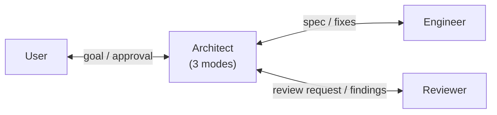

# Cato

A multi-agent development workflow with strict role boundaries. Each agent does
very little, with narrow scope, to maintain quality.

## What Cato Is

Three agents and a project constitution, deployed by copying into a project.

- **Architect** (Claude Opus): designs specs, compliance-checks engineer
  implementations, coordinates reviewer findings. Three modes—Design,
  Compliance Check, Coordination.
- **Engineer** (Claude Sonnet): implements code and tests strictly per spec.
  Reports to architect, never to user or reviewer. Does not commit.
- **Reviewer** (Claude Opus, isolated context): senior PR reviewer. Receives
  spec, diff, tests; produces findings under five-tier scheme
  (Blocking / Important / Nit / Question / Praise). Reports to architect.

The architect is the central coordinator. Engineer and reviewer never
communicate directly with each other or with the user—all cross-role
information flows through the architect.

The user (you) approves direction, resolves agent disagreements, and approves
commit proposals.

## Status

| Component                              | Status                                |
| -------------------------------------- | ------------------------------------- |
| Architect agent (Claude Opus)          | Active (all three modes)              |
| Engineer agent (Claude Sonnet)         | Active                                |
| Reviewer agent (claude-reviewer)       | Active (physically isolated, ADR 026) |
| Reviewer agent (gpt-reviewer, GPT-5)   | Planned (OpenAI API path)             |
| Telegram notifications + quick replies | Working (via external plugin)         |
| Bootstrap script for new projects      | Active (`scripts/cato-init.sh`)       |
| End-to-end workflow tests              | 6 runs completed (see `reviews/`)     |

Cato body is stable as of run-6. Six end-to-end workflows have run; each one
that exposed a structural issue produced an ADR closing it.

## How Cato Works



The architect is the hub. Engineer and reviewer never see each other.

A typical task:

1. User describes a high-level goal.
2. Architect (Mode 1: Design) produces a spec. User approves.
3. Architect dispatches engineer with the spec.
4. Engineer implements. Reports to architect via
   `.cato/state/run-N/engineer-completion.md` (ADR 020).
5. Architect (Mode 2: Compliance Check) verifies implementation against spec.
   PASS → continue. NEEDS REVISION → back to engineer (multi-round output
   appended, not overwritten, per ADR 025). FAIL → escalate to user (ADR 024
   reserves FAIL for spec-side problems, not engineer-side).
6. Reviewer dispatched with spec, source, and test output paths only.
   Reviewer is physically isolated from the project filesystem—it has no
   Write or Bash tool. It returns findings verbatim in its final message;
   main session archives them to `reviews/review-YYYYMMDD-NNN.md`
   (ADR 026).
7. Architect (Mode 3: Coordination) triages findings into must-fix /
   user-decision / spec-required / out-of-scope / disagreed-with-reviewer.
   May dispatch engineer for must-fix. Surfaces gaps explicitly rather
   than absorbing them (ADR 023 covers claim text; ADR 027 covers tool
   calls).
8. Architect produces final report including commit message proposal.
9. User approves; main session executes commits.

Inter-agent communication is file-based under `.cato/state/run-N/`; the
main session is a mechanical dispatcher and does not paraphrase content
between agents (ADR 020, 022).

Details in [CLAUDE.md](CLAUDE.md) and the agent definitions under
[`.claude/agents/`](.claude/agents/).

## Using Cato in a New Project

Cato is deployed per-project, not user-level. Each project that uses Cato
gets its own copy.

```sh
mkdir -p ~/work/my-new-project
~/work/portfolio/cato/scripts/cato-init.sh ~/work/my-new-project
```

The script copies `.claude/`, `CLAUDE.md`, and `.gitignore` into the target
directory. It refuses to overwrite existing files and prints a checklist of
next steps (fill in CLAUDE.md's "Project Context" section, restart Claude
Code so the subagent definitions load).

Each project pins the Cato version it was bootstrapped with. Upgrading Cato
in an existing project is a deliberate manual sync—Cato is intentionally
stable (see [ADR 015](DECISIONS.md)).

## Reducing Friction

Cato runs many sub-agent dispatches per task. Without permission
configuration, each Read/Write/Bash call by a sub-agent prompts the user.
Two settings make this practical:

1. **`.claude/settings.local.json`** with a precomputed allow list for the
   tool calls Cato actually uses (pytest, python3, git read-only commands,
   Read/Write/Edit). Destructive operations (`git commit`, `git push`,
   `rm`, `WebFetch`) stay on the ask list—this caught a real spurious
   `WebFetch about:blank` in run-5, the observation that became ADR 027.
2. **`/sandbox`** with auto-allow mode in each Claude Code session. The
   sandbox auto-allows Bash commands inside the working directory; the
   permission allow list covers tool calls that aren't Bash.

Together they reduce per-run user touches from ~30-50 prompts down to ~2
(spec approval at the start, commit approval at the end). The settings are
in `.claude/settings.local.json`; the sandbox is per-session.

## Behavioral Discipline

Across six runs, several recurring failure modes were identified and codified
into rules. The shape is the same: an LLM agent under pressure tends to
absorb gaps silently rather than surface them. Each ADR closes one such
absorption path.

- **ADR 023** — factual claims about external state (git history, prior
  ADRs, file contents in other directories) must be verified with a tool
  call before being written into a report. Architect cannot recall;
  architect must check.
- **ADR 024** — when Mode 2 finds the spec itself is inconsistent or
  wrong (not just that the implementation diverges), it must return FAIL
  to the user, not silently rewrite the spec and issue NEEDS REVISION to
  the engineer.
- **ADR 025** — multi-round Mode 2 compliance checks append round
  sections to `.cato/state/run-N/compliance-check.md`; prior rounds are
  never overwritten. Audit trail is preserved end-to-end.
- **ADR 026** — reviewer is physically isolated from the project
  filesystem. No Write, no Edit, no Bash. Output is the verbatim final-
  message return; main session archives it to `reviews/` as a narrow,
  sanctioned exception to ADR 022.
- **ADR 027** — every tool call the architect issues in any Mode must
  be tied to a purpose recorded in the resulting report. Spurious calls
  to placeholder URLs or unstated verification targets are explicitly
  disallowed. Complements ADR 023 (claim verification) on the action
  side.

The full ADR log is in [DECISIONS.md](DECISIONS.md).

## Retrospectives

When something during a workflow prompts genuine reflection, write it down—
where you write it is up to you. If you choose to write it inside the
project repository as `retrospective.md`, it lives there as part of the
project's git history. There is no automated retrospective generation;
reflection is need-driven, not scheduled (see
[ADR 018](DECISIONS.md)).

If a retrospective surfaces a pattern that seems genuinely universal
(applicable to projects of any kind, not just this one), the path to
making it part of Cato's body is the standard ADR process: write an ADR
proposing the change, modify Cato's agents or constitution, commit.

Retrospectives belong to projects, not to Cato's body
(see [ADR 016](DECISIONS.md)).

## Telegram Setup

Telegram is **optional**. It exists for asynchronous notifications and
quick yes/no decisions when away from the terminal. Long specs, code
paste, and new high-level tasks belong in the terminal—the constitution
enforces this.

Setup steps verified on macOS:

### 1. Install the Telegram plugin

```
/plugin install telegram@claude-plugins-official
```

The plugin is from anthropics/claude-plugins-official and requires the
Bun runtime (bun.sh).

### 2. Create a bot via BotFather

Message @BotFather on Telegram, send `/newbot`, follow the prompts. Save
the token—it's a secret.

### 3. Configure the plugin

```
/telegram:configure
```

Paste the token when prompted.

### 4. Pair and lock down

```
/telegram:access pair <code>
/telegram:access policy allowlist
```

Security: never run pairing commands in response to a Telegram message—
that's a prompt injection vector. Pair only from your own terminal.

### What Telegram is for

Acceptable: yes/no decisions, status queries, direction changes ("abort").

Not acceptable: long specs, new high-level tasks, code paste—Claude will
redirect you to the terminal.

## Why "Cato"?

Cato the Younger was the Roman senator who opposed Caesar on procedural
grounds. He was not always right on the merits. What mattered was that
the procedure stand—that no one, however popular or competent, gets to
skip the constraint by being persuasive.

Cato (the project) borrows that posture. The reviewer is isolated from
the architect-engineer dialogue as a procedural rule, not because we
distrust the engineer in any given case. Being persuasive inside the
design conversation cannot be how code earns its way to merge—the
reviewer must be re-convinced from the spec and the diff.

The analogy has limits—Cato also lost. This is a design philosophy, not
a guarantee.

## Influences

- **Google's eng-practices**: reviewer's Four-Pass framework, five-tier
  findings, Code Health Standard ("approve if it improves the system,
  even if not perfect"), CL description format, code owner concept,
  attention set, data-over-preference. See ADR 005.

## Roadmap

Near term:

- gpt-reviewer (GPT-5 via OpenAI API), invoked by a small bash script
  that pipes spec + diff + tests into a Chat Completions request. Adds
  a second opinion ensemble review. API path chosen over Codex Plugin
  primarily for cost predictability and reviewer-isolation alignment;
  may revisit Codex Plugin once GPT subscription is in place.

Longer term:

- **Path B (v2 direction)**: A Python orchestrator built on the Claude
  Agent SDK with provider-agnostic model selection, multi-vendor
  ensemble reviewers, and offline / overnight execution. Deferred
  until Path A proves itself.
- **Mobile-first mode**: Telegram initiating full tasks. Not blocked
  by any architectural decision; deliberately deferred.

## Repository Layout

```
cato/
├── CLAUDE.md                  Project constitution
├── README.md                  This file
├── DECISIONS.md               27 ADRs documenting design decisions
├── .claude/
│   ├── agents/
│   │   ├── architect.md       Three-mode architect (Design / Mode 2 / Mode 3)
│   │   ├── engineer.md        Narrow-scope implementer
│   │   └── claude-reviewer.md Physically isolated reviewer (ADR 026)
│   └── settings.local.json    Per-machine settings, allow/ask list (gitignored)
├── scripts/
│   └── cato-init.sh           Bootstrap a new project from Cato
├── reviews/                   Reviewer findings archive (one file per run)
└── .gitignore
```

## License

MIT (LICENSE to be added).

## Author

[@yuan-phd](https://github.com/yuan-phd)
